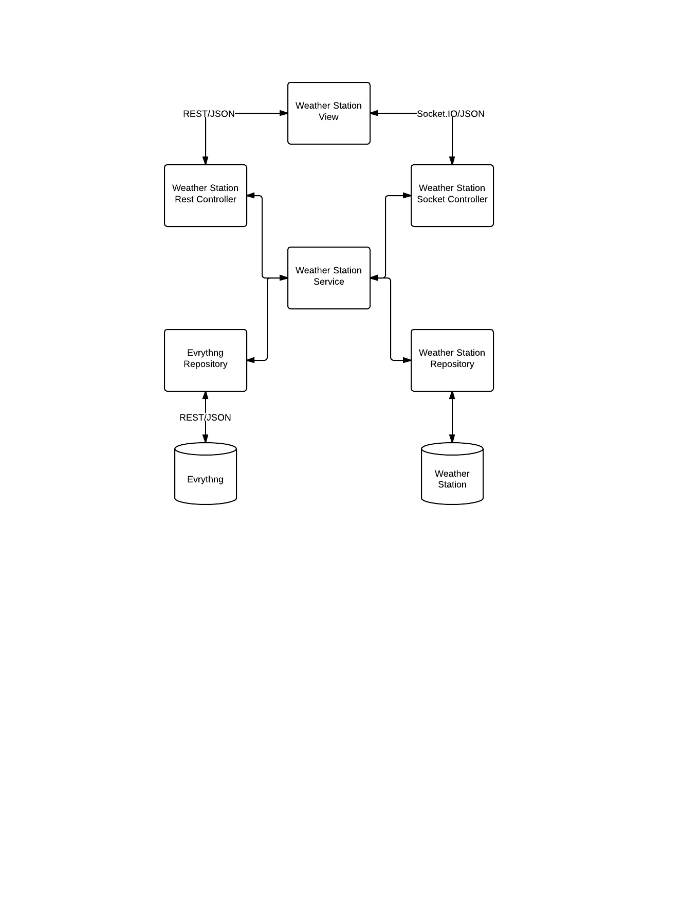

Weather Station
=========

This is a simple application that uses the Evrythng API to collate real time data from multiple sensor and displays the output in a web page.

To run this application simply run the Application class, this contains the main method and uses Spring boot to wire up and start the application.
 
 It should be possible to run mvn clean install to generate an Uber Jar, however I am currently having a few problems with that.
 
 The application runs on port 8080 on the location machine so you should be able to connect to [127.0.0.1:8080](127.0.0.1:8080) once the application has started.
 
 To access there is a button in the top right to of the home page to access the main application, where you will be prompted for a username and password. user and password are the current configured defaults for this.
 
 Once you have logged in, you will be presented with the sensor over view page. This list all the sensor available to the application. The name of the sensor is also a hyperlink to the individual sensor page.
 
 On the individual sensor page you will be presented with the description of the sensor, the current reading and a list of previous readings.
 
 My initial hope was to have the current reading and the readings table updated in "real time" via a web socket, however time constants did not allow me to complete this. An example of using websockets in Springboot can be found [here](https://github.com/mgt6/java-chat). This is an investigation that I did into using websockets in spring after a spring conference.
 
###Architecture

###User Stories

####Story 1
As a user I want to be able to log in so that I can view secured assets.

Complete
 
####Story 2
As a user I want view all of the sensors that I own so that I can get a complete list.

Complete

####Story 3
As a user I want to view the latest readings from an individual sensor so that I can get the current measurements

Complete

####Story 4
As a user I want to view all the readings for an individual sensor for a given time period so that I can view the change over time

Complete

####Story 5
As a user I want to view the latest reading from an individual sensor in real time so that I can monitor the current measurement.

Deferred
 